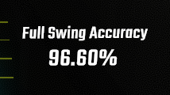
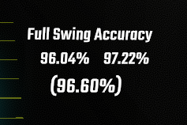

# No Swing Loss Counter

CountersPlus custom counter to show your percentage if you were fullswinging.

This mod also supports split value for each hands which can be configured on CountersPlus.

## Counters options

| Option                     | Description                                                                      |
| -------------------------- | -------------------------------------------------------------------------------- |
| Separate Saber             | Shows no swing loss accuracy percentage for each saber (shown as separate value) |
| Exclude dotted chain notes | Excludes dotted chain notes (tail) from accuracy percentage calculation          |

## Development

- Install Visual Studio 2022
- Add modding tools: https://github.com/Zingabopp/BeatSaberModdingTools/wiki/How-to-Download-and-Install
  - You may use latest version of BeatSaberModdingTools here: https://github.com/denpadokei/BeatSaberModdingTools/releases

## Bug or feature request

[Go here](https://github.com/daftmaple/NoSwingLoss/issues/new/choose)

## Changelog

v1.0.2

- Removed arrowed chain notes normalisation
- Added support for different scoring model

v1.0.1

- Support for link & chain notes

v1.0.0

- Initial project
