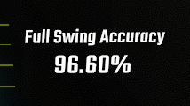

# No Swing Loss Counter

CountersPlus custom counter to show your percentage if you were fullswinging.

This mod also supports split value for each hands which can be configured on CountersPlus.

## Counters options

| Option                                    | Description                                                                                                       |
| ----------------------------------------- | ----------------------------------------------------------------------------------------------------------------- |
| Separate Saber                            | Shows no swing loss accuracy percentage for each saber (shown as separate value)                                  |
| Exclude dotted chain notes                | Excludes dotted chain notes (tail) from accuracy percentage calculation                                           |
| Assume normal note on arrowed chain notes | Treats arrowed chain notes (head) as normal note. Treats it as a note with maximum accuracy of 115 instead of 85. |
